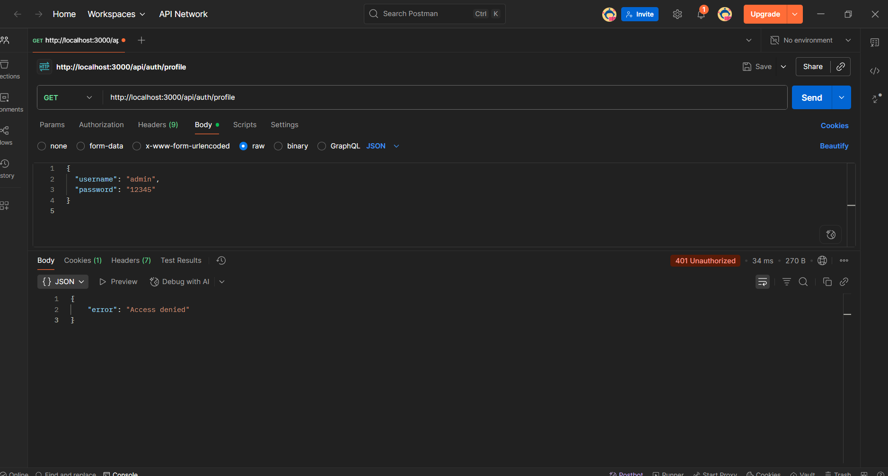
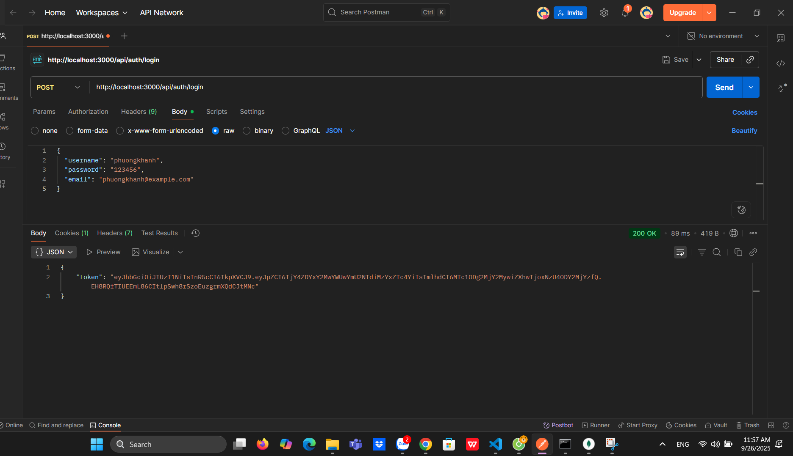
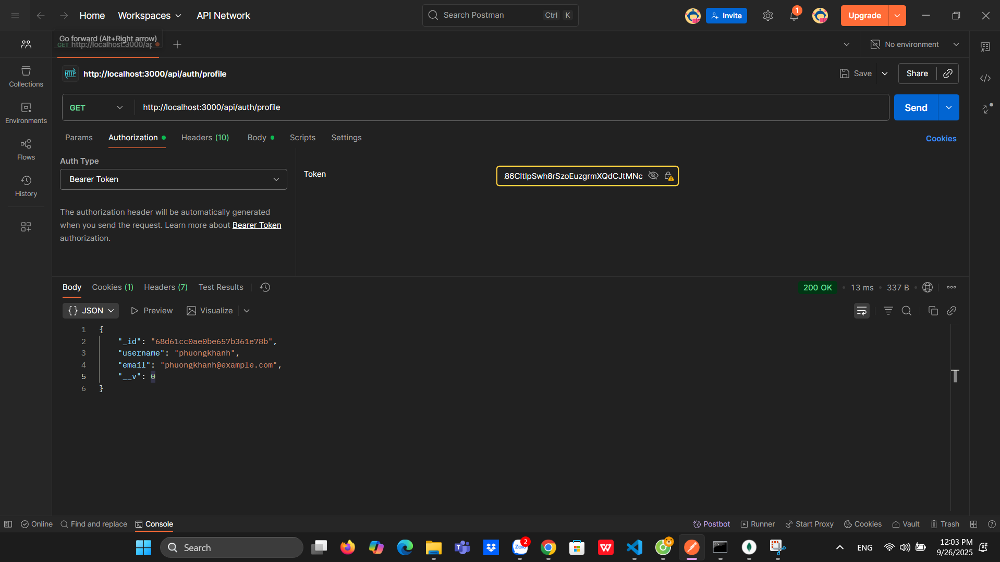

# 🔑 Token-Based Authentication Example

## 📌 Mô tả
Dự án minh họa cơ chế **Token Authentication (JWT)** bằng Node.js.  
Người dùng đăng ký, đăng nhập sẽ nhận **token**, dùng token này để truy cập các route bảo vệ, ví dụ `/profile`.  
Token có thể được cấu hình để **hết hạn** sau một khoảng thời gian nhất định.

## 🚀 Cài đặt & chạy
# Cài đặt các package
npm install
# Chạy server
node app.js
## 🧪 Test bằng Postman
1️⃣go to profile
GET http://localhost:3000/api/auth/profile

2️⃣ Tạo tài khoản regiter
POST http://localhost:3000/api/auth/register

3️⃣Login & Copy Token
POST http://localhost:3000/api/auth/login

4️⃣Go to Profile with Token
GET http://localhost:3000/api/auth/profile
